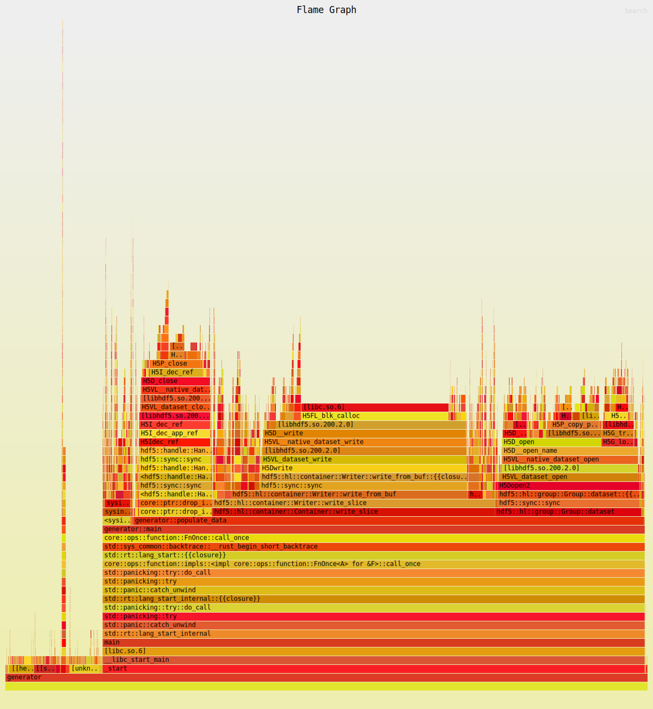

# Performance Benchmarking in Rust
## Introduction
Hi, I'm Joey, and I created a native application that was only 30% faster than horribly inefficient Python code. Where could I have possibly gone wrong? Is it the libraries I chose? Am I using some of them improperly, maybe?

Unfortunately, without a good profiling tool these questions are basically impossible to answer. So, what is a good profiling tool?

## [Flamegraph](https://github.com/flamegraph-rs/flamegraph)
Flamegraph is a tool made in Rust that can be used to run performance analysis on many different kinds of code. It also has very good support for Rust. If you are a rust user, it can be easily installed into Cargo using

```
cargo install flamegraph
```

You will also need some performance libraries installed. See the link above for specifics, but if you are an Arch linux user, just run the following command to install them:

```
sudo pacman -S perf
```

Now, to use the tool, just use the `cargo flamegraph` command. It will generate an `svg` file like the one shown below.

[](optimization_none.svg)

Unfortunately this can be difficult to view in the readme, but if you open the link in your browser you will get a very confusing-looking, yet interactive stack of function calls.

### How to read flamegraphs
Picture the base of the graph as your main function. It is where your program starts, and all other functions are executed from it. Notice that towards the bottom of the plot, the rows span the width of the page. Each row represents a function, and its width is determined by how much time it spent being executed. That's why your main function is so large - because it ran for pretty much the length of the entire program.

As you look up the rows, you'll start to see the functions that main() calls, and the functions that they call. Every new row is another layer of nesting in the code.

# Pre-Optimization
As you can see from the flamegraph above, the only function that runs remotely as long as main() is the populate_data() function. The way the code is broken down, main generates a file, and then prepares the system sensors, and finally starts a loop which calls the populate_data() function until enough data is collected. The populate_data() function takes in sensor inputs and writes their current values into an HDF5 file.

Looking inside that function, we can see that a significan amount of time is spent in the write_slice function in the HDF5 library.

The predicted* runtime for a release build is 
```
5 days 8 hours 22 minutes and 57 seconds
```

<i>* Predicted based on the collection time of 2,000 measurements</i>

# Optimization 1
In its current implementation, the dataset generator, is writing each individual measurement to the hdf5 file as it obtains them. It was partially done this way because I was under the impression that HDF5 did buffered reading and writing by default. After viewing the flamegraph, I no longer hold that viewpoint.

An easy optimization, and the first one I will perform, is not appending single elements to multidimensional datasets like the `grouped_cpu_frequency`. Instead, I can write the frequency for all cpus at once. This should lower the amount of time the write_slice function runs for in total.