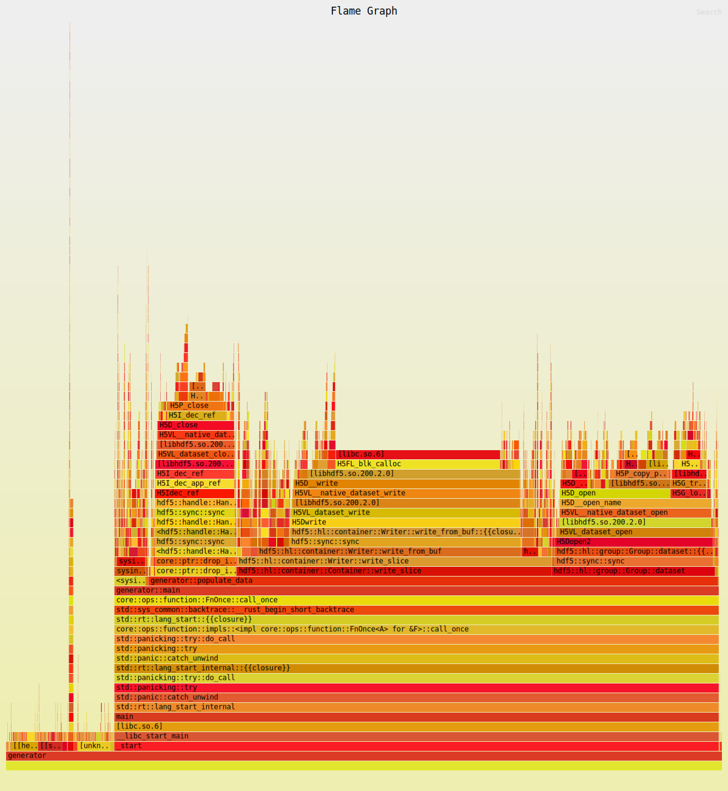
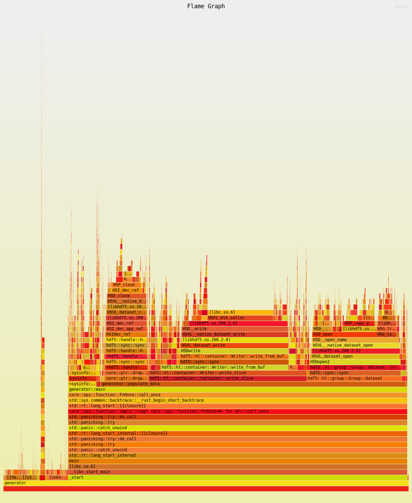
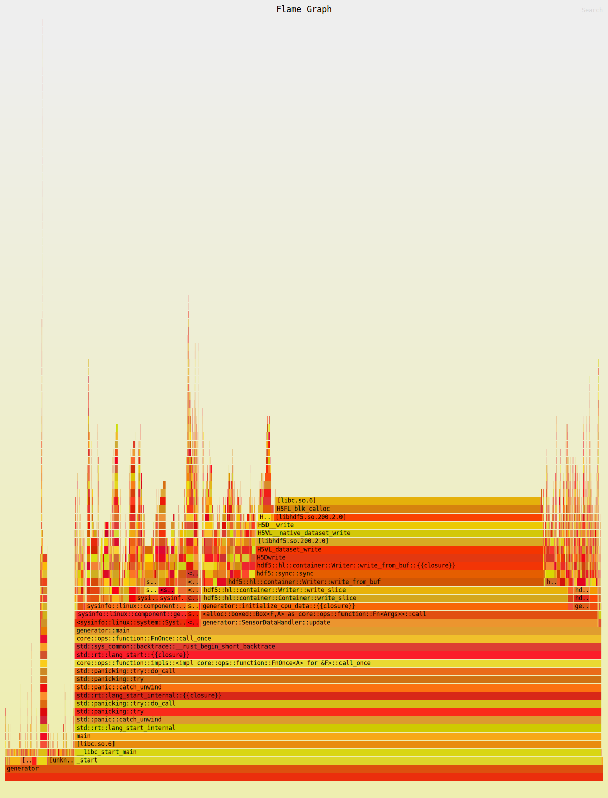

# Performance Benchmarking in Rust
## Introduction
Hi, I'm Joey, and I created a native application that was only 30% faster than horribly inefficient Python code. Where could I have possibly gone wrong? Is it the libraries I chose? Am I using some of them improperly, maybe?

Unfortunately, without a good profiling tool these questions are basically impossible to answer. So, what is a good profiling tool?

## [Flamegraph](https://github.com/flamegraph-rs/flamegraph)
Flamegraph is a tool made in Rust that can be used to run performance analysis on many different kinds of code. It also has very good support for Rust. If you are a rust user, it can be easily installed into Cargo using

```
cargo install flamegraph
```

You will also need some performance libraries installed. See the link above for specifics, but if you are an Arch linux user, just run the following command to install them:

```
sudo pacman -S perf
```

Now, to use the tool, just use the `cargo flamegraph` command. It will generate an `svg` file like the one shown below.

[](optimization_none.svg)

Unfortunately this can be difficult to view in the readme, but if you open the link in your browser you will get a very confusing-looking, yet interactive stack of function calls.

### How to read flamegraphs
Picture the base of the graph as your main function. It is where your program starts, and all other functions are executed from it. Notice that towards the bottom of the plot, the rows span the width of the page. Each row represents a function, and its width is determined by how much time it spent being executed. That's why your main function is so large - because it ran for pretty much the length of the entire program.

As you look up the rows, you'll start to see the functions that main() calls, and the functions that they call. Every new row is another layer of nesting in the code.

# Pre-Optimization
As you can see from the flamegraph above, the only function that runs remotely as long as main() is the populate_data() function. The way the code is broken down, main generates a file, and then prepares the system sensors, and finally starts a loop which calls the populate_data() function until enough data is collected. The populate_data() function takes in sensor inputs and writes their current values into an HDF5 file.

Looking inside that function, we can see that a significant amount of time is spent in the write_slice function in the HDF5 library.

The predicted* runtime for a release build is 
```
5 days 8 hours 22 minutes and 57 seconds
```

<i>* Predicted based on the collection time of 2,000 measurements</i>

# Optimization 1
In its current implementation, the dataset generator, is writing each individual measurement to the hdf5 file as it obtains them. It was partially done this way because I was under the impression that HDF5 did buffered reading and writing by default. After viewing the flamegraph, I no longer hold that viewpoint.

An easy optimization, and the first one I will perform, is not appending single elements to multidimensional datasets like the `grouped_cpu_frequency`. Instead, I can write the frequency for all cpu's at once. This should lower the amount of time the write_slice function runs for in total.

After completing the work above, our current flamegraph is looking a little more even:

[](optimization_one.svg)

In fact, the new predicted runtime is
```
4 days 11 hours 28 minutes and 57 seconds
```

That is honestly way more than I would expect out of such a small change. I didn't think these excess writes had this big an effect!

# Optimization 2
Even though the `write_slice` function still makes up about half of the execution time of the `populate_data` function, I am going to switch gears for optimization two. In the flamegraph, `write_slice` is between two large 'flames' which appear to be related to the hdf5 datasets I am using.

I am led to believe that calling `file.dataset("dataset_name")` is causing a new read operation on the file every measurement frame. Furthermore, since the datasets are not being stored into a variable, they are also being destroyed every frame. I believe this is why there are large dataset-centered chunks of time being taken up before and after actually writing to the dataset.

The solution to Optimization 2 involves storing the datasets when they are created, and keeping them in memory until the end of the program. This will mean the loading and saving bits only really need to be called once, not 10,800,000 times as they currently are.

The actual implementation I used is to follow a more structural approach. I introduced the `SensorDataHandler` type, whose `new()` function creates a dataset in the file and then takes in a closure which represents how to get the current value. This had a massive effect on the resulting flamegraph:

[](optimization_two.svg)

You'll notice that the flames that once surrounded the `write_slice` flame are now completely gone. Now that the datasets are only being created and destroyed once, the time they require to run is negligible. Now, reading the actual sensor data has much more significant an effect - and the write_slice function continues to consume most of the runtime power.

What was most surprising though, is the runtime of the program is now LONGER! >:(
```
5 days 1 hour 8 minutes and 34 seconds
```

So basically, with these changes I have went and completely messed up the previous optimization (though it is still implemented). Overall I'm very disappointed. It still looks like a majority of the time is in the `write_slice` method of the datasets so I don't think the closures added enough overhead to mess with the time to that degree.

I did move the time remaining calculation logic to a new place (the update loop), so there is a chance that the calculation is done slightly differently now. Nevertheless, it is surprising how the flamegraph appeared to improve but the runtime did not.

# Optimization 3
While we've made some improvements and some not-improvements to the data generation program, there is still one more trick I can take to improve the speed of the program, and I expect it to have the most significant effect of any optimization done so far. Currently, the program is starting to be bottle-necked by the collection of sensor data, though IO operations still account for more than HALF of the total runtime.

Thankfully, with the modifications made in Optimization 2, all the logic around IO is now in a single place, or at least won't require as much modification to pull into one place.

My idea to decrease the number of IO operations is to implement a buffering system. Instead of writing every sensor update, I will store, say 10,000 measurements per dataset in memory before writing them. Then I will perform the write operation and clear out the buffer. This optimization will increase the RAM usage of the program, but it will drastically decrease the number of IO calls that are required.